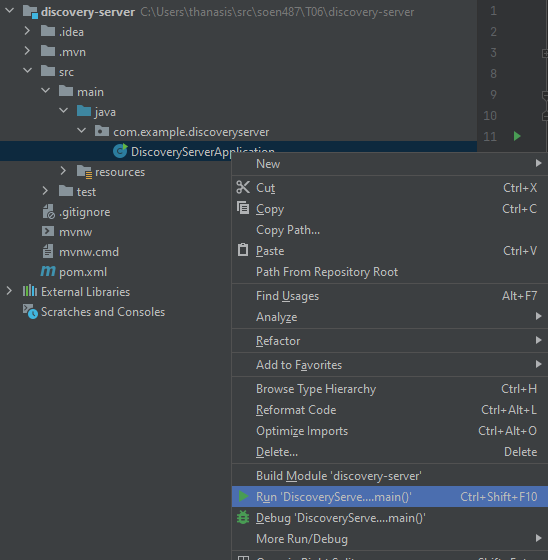

# T06 - SOEN 487 #

This is the template provided to start the web server for Tutorial 4.
You should download this repository to follow along when watching the tutorial.

The finished example can be found on the finished branch of this repository.

We encourage you to use either IntelliJ IDE or maven from command line in order to get the best support from our TAs.

## Existing Projects ##

1) The **restaurant-api** maven project holds the REST implementation of the Customer class from the third tutorial. It also holds the class
**RestaurantApiApplication** generated by Spring Initializr, which handles running the eureka client.

2) The **discovery-server** project which will hold the server implementation created using Spring Initializr.

## IntelliJ Instructions ##

You can simply go to File -> Open, find the project folder and open it. IntelliJ should handle the rest since the maven files are already there.

Follow the tutorial on how to create the server using Spring Initializr and how to setup the existing API to work with the Eureka service Registry. 

When the setup is done, you can first start the server by running the Application java file (eg. DiscoveryServerApplication.java) and then running the same for the restaurant-api project (eg. RestaurantApiApplication.java).

## Maven Instructions ##

    Run the folllowing commands in the associated project directory:

    In discovery-server directory:
        mvn install
        mvn spring-boot:run
    Switch to restaurant-api directory:
        mvn install
        mvn spring-boot:run

