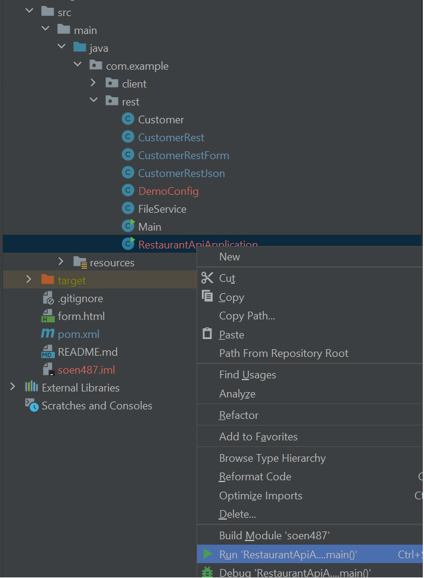
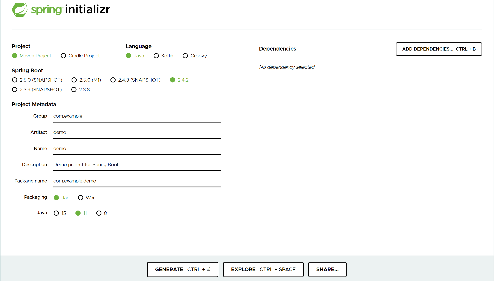

# T06 - SOEN 487 #

This is the template provided to start the web server for Tutorial 6.
You should download this repository to follow along when watching the tutorial.

The finished example can be found on the finished branch of this repository.

We encourage you to use either IntelliJ IDE or maven from command line in order to get the best support from our TAs.

## Existing Projects ##

Our starting point for this tutorial will be the finished branch of Tutorial 3. The goal is to start a eureka server and make our existing REST service discoverable.

## IntelliJ Instructions ##

You can simply go to File -> Open, find the project folder and open it. After opening it with IntelliJ, right click on the pom.xml file and clico on "Add as Maven Project".

Follow the tutorial on how to create the server using Spring Initializr and how to setup the existing API to work with the Eureka service Registry. 

When the setup is done, you can first start the server by running the Application java file (eg. DiscoveryServerApplication.java) and then running the same for the restaurant-api project (eg. RestaurantApiApplication.java).

## Spring Initializr ##

To create a maven project with Spring Initializr, go to start.spring.io, select the options that fit your environment, add the dependencies and click on generate. More info in slides for the tutorial.

## Maven Instructions ##

    Run the folllowing commands in the associated project directory:

    In discovery-server directory:
        mvn install
        mvn spring-boot:run
    In customer service directory:
        mvn install
        mvn spring-boot:run

